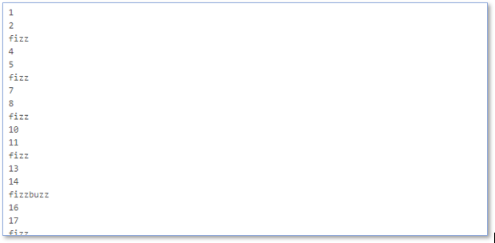

[<<Zurück zur Übersicht](https://github.com/codewiththomas/c-challenges)

## Challenge 02 - FizzBuzz

### Aufgabe 

#### Basic Mode
Hier mal ein Klassiker für Programmiereinsteiger. Unser Programm soll die Zahlen 1 bis 100 hochzählen. Ist die Zahl durch 3 teilbar, soll "fizz" ausgegeben. 
Bei Teilbarkeit durch 5 soll "buzz" ausgegeben werden. Ist die Zahl sowohl durch 3 als auch durch 5 teilbar, wird entsprechend "fizzbuzz" als Ausgabe 
erwartet. In allen anderen Fällen soll die Zahl selbst ausgegeben werden.

#### Advanced Mode
Lagere Deine Fizzbuzz-Logik in eine eigene Funktion aus. Diese soll durch in der Schleife, welche sich in der main()-Methode befinden, für
jede Zahl aufgerufen werden

    void fizzBuzz(int number)
    {
        //TODO: your implementation
    }

#### Expert Mode 
Schreibe eine Funktion, welche den Rest bei der Division von ganzen Zahlen ermittelt. In dieser darf der Modulo-Operator nicht verwendet werden - 
findest Du einen eigenen Ansatz?

    int getRest(int dividend, int divisor)
    {
        // TODO: your implementation
    }

#### Hardcore Mode
Im Debugmodus soll immer die Zahl und dahinter ggf. die Wörter "fizz", "buzz", "fizzbuzz" ausgegeben werden. Definiere dabei eine Konstante 
DEBUG als Präprozessordirektive. Ohne DEBUG-Mode soll die Ausgabe unverändert zum Basic-Mode aussehen.

### Lösung

Die Lösung wird jeweils am Folgetag der Veröffentlichung der Aufgabe im Ordner solution eingestellt.

[<<Zurück zur Übersicht](https://github.com/codewiththomas/c-challenges)
