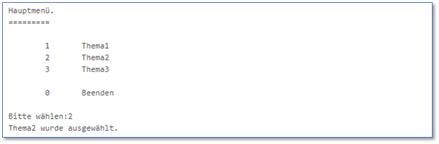

[<<Zurück zur Übersicht](https://github.com/codewiththomas/c-challenges)

## Challenge 05 - Lexikon

### Aufgabe 

#### Basic Mode
Die letzten Challenges hatten alle was mit Zahlen zu tun. Daher wollen wir uns mal ein bisschen mehr um Wörter 
kümmern. Da wir ohnehin für eine Prüfung lernen, bietet sich doch ein kleines Nachschlagewerk an.

Schreibe ein Programm, welches folgende Ausgabe erzeugt. 

Erwartete Ausgabe:

Die Themenübersicht soll dabei dynamisch sein, d.h.
Dein Code sollte die Ausgabe flexibel auf eine Themenanzahl von 0 - 255 gestalten (bei 0 gibt es kein Thema).

Nun soll der Nutzer gefragt werden, welches Thema ihn interessiert. Bei der Eingabe von 0 soll das Programm beendet 
werden. Bei Auswahl einer Zahl soll angezeigt werden "ThemaX wurde gewählt". Versuche das Ganze mit einer 
switch-case-Anweisung umzusetzen.

#### Advanced Mode

Das Programm soll in einer Endlosschleife laufen. Jedes mal, wenn ein Themengebiet angezeigt wurde, soll danach 
wieder das Hauptmenü angezeigt werden und der Nutzer kann eine weitere Auswahl treffen.

#### Expert Mode 

Du hast die Headerdatei "[encyclopedia.h](./source/encyclopedia.h)" und die dazugehörige CodeDatei "[encyclopedia.c](./source/encyclopedia.c)" erhalten (siehe Ordner [source](./source/)), mit welchen 
sich ein (sehr einfaches) Lexikon verwalten lässt. Binde beide Dateien in Dein Projekt ein und ergänze eine 
include-Anweisung auf die neue Headerdatei (Hinweis: Worauf musst Du beim Einbinden einer eigenen Bibliothek achten?). 

Schau Dir die Header-Datei etwas genauer an, diese enthält 4 Funktionen, welche Du nutzen kannst. Die Codedatei
würde man im Realfall meist gar nicht einsehen können, diese wird in der Regel als vorkomplilierte Binärdatei
mitgegeben. In unserem Fall habe ich sie Quelloffen gelassen, so könnt ihr bei Interesse noch mal den Einsatz
einer Struct in Verbindung mit typedef, Arrays und Präprozessordirektiven sehen.

Nutze die Funktion zum Hinzufügen, um folgende Artikel hinzuzufügen
* Ganzzahlige Datentypen
* Weitere Datentypen
* Wichtigste Steuerungszeichen
* Verzweigungen
* Präprozessoranweisungen
* Schleifentypen
* Impizite vs Explizite Umwandlung 

Die Übersicht stellt nur die Artikeltitel dar. Selbstverständlich ergänzt Du diese um eine sinnvolle Beschreibung.

#### Hardcore Mode

Passe Dein Übersichtsmenü so an, dass jeweils die ArtikelId (zwischen 1 - getArticleCount()) und der dazugehörige
ArtikelTitel angezeigt werden. Bei der Auswahl des Themas durch den Nutzer soll die dazugehörige Beschreibung 
angezeigt werden.

Ergänze noch mindestens 5 weitere Artikel.

### Lösung

Die Lösung wird jeweils am Folgetag der Veröffentlichung der Aufgabe im Ordner solution eingestellt.

[<<Zurück zur Übersicht](https://github.com/codewiththomas/c-challenges)
